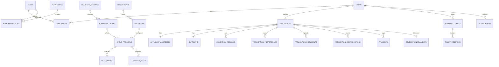

# Developer Handbook — Netaji College of Pharmacy Data Hub

This is the technical handover document for the Netaji College of Pharmacy website, admissions platform, applicant portal and administration system.

> **Current implementation status:** Release 1 is implemented and tested. Phase 2 has been defined with the owner but has **not yet been implemented**. The distinction between current functionality and planned functionality is documented below so that nobody mistakes a roadmap item for a working feature.

## 1. Product summary

The application is a reusable college website and central data hub, initially branded **Netaji College of Pharmacy**. Release 1 focuses on public content and the complete admission lifecycle. Its shared identities, departments, programmes, sessions, permissions, settings, notifications and audit records are intended to become the foundation of a broader college ERP.

The software is deliberately built for common Indian PHP hosting and local XAMPP installations:

- PHP 8.1 or newer;
- Apache with `mod_rewrite` and `mod_headers`;
- MySQL 5.7+ or MariaDB 10.4+;
- server-rendered PHP and HTML;
- responsive CSS and small vanilla JavaScript enhancements;
- Composer packages for PHPMailer and Dompdf;
- no Node.js runtime, npm, frontend compiler or Node server.

The seeded college identity and all seeded academic/approval information are demonstrations. Deploying institutions must replace and verify names, addresses, affiliations, approvals, rules, fee amounts and signatories.

## 2. Current release boundary

### Implemented in Release 1

- Public institutional website and CMS.
- English, Bengali and Hindi translation foundations with English fallback.
- Applicant registration, email verification, login and password recovery.
- Optional SMTP-delivered staff MFA/OTP.
- Configurable admission sessions, cycles, programmes, eligibility rules, seat matrix, fees and document requirements.
- Complete Indian admission form and protected document upload.
- Application review, assignment, eligibility indicators, corrections, decisions and history.
- Manual application/admission payment-proof verification and receipts.
- Admission conversion into `student_enrollments` using the existing applicant account.
- Applicant notices, messages, generated documents and support tickets.
- Staff dashboards, RBAC, CMS, reports, CSV export, enquiries, settings, audit log, mail log and encrypted backups.
- Responsive public, authentication, applicant and administration interfaces.
- HTTP acceptance tests for real browser-session flows and Dompdf output.

### Not implemented yet

These are not hidden or partially functional Release 1 modules:

- semester curriculum and subject registration;
- faculty workload and timetable operations;
- classroom attendance;
- assessments, examinations, marks, grades, SGPA/CGPA or transcripts;
- recurring tuition/semester fee ledger;
- library circulation;
- hostel operations;
- transport operations;
- inventory or procurement.

The Phase 2 scope approved by the owner is in [Section 20](#20-approved-phase-2-scope).

## 3. Architecture at a glance

```text
Browser
  │
  ▼
Apache / public/.htaccess
  │
  ▼
public/index.php (front controller)
  ├── loads Composer or the fallback PSR-4 autoloader
  ├── loads .env
  ├── checks install and maintenance state
  └── creates App\Core\Application
          │
          ├── starts secured PHP session
          ├── ages flash data
          ├── sends security headers
          └── dispatches routes/web.php through App\Core\Router
                    │
                    ├── CSRF validation for every POST
                    ├── auth / guest / role / permission middleware
                    └── controller action
                          ├── PDO queries and transactions
                          ├── domain services
                          ├── audit and notifications
                          └── App\Core\View
                                ├── resources/views/<feature>.php
                                └── resources/views/layouts/<layout>.php
```

This is a custom MVC-style application, not Laravel, Symfony or WordPress. It intentionally has a small framework surface.

### Important implementation characteristic

There is currently no ORM or model layer. Controllers use the `App\Core\Database` PDO wrapper directly. New code must use prepared statements through `Database::query()`, `fetch()`, `all()`, `scalar()`, `insert()` or `update()` and should wrap related writes in `Database::transaction()`.

## 4. Repository map

| Path | Responsibility |
|---|---|
| `public/index.php` | Front controller and application bootstrap. |
| `public/.htaccess` | Apache URL rewriting and public-directory behavior. |
| `public/install/` | Browser-based first installation into a clean database. |
| `public/assets/css/` | Public, portal and responsive styling. `ui-polish.css` is loaded last. |
| `public/assets/js/app.js` | Navigation, sidebar, tabs, upload labels, print and small UI interactions. |
| `routes/web.php` | Complete GET/POST route registry and middleware declarations. |
| `app/Core/` | Environment, config, database, router, auth, CSRF, validation, encryption, translation, flash and view infrastructure. |
| `app/Controllers/` | Public, authentication, applicant, protected-file and document controllers. |
| `app/Controllers/Admin/` | Admissions processing, support, CMS, reports and system administration. |
| `app/Services/` | Mail, uploads, eligibility checks, audit, CMS media and encrypted backups. |
| `app/Support/helpers.php` | Escaping, URLs, assets, CSRF field, flash, translation, date and money helpers. |
| `resources/views/` | Server-rendered pages and layouts. |
| `resources/lang/` | Manually maintained `en.php`, `bn.php` and `hi.php` interface dictionaries. |
| `config/` | PHP configuration mapped from `.env`. |
| `database/schema.mysql.sql` | Authoritative initial MySQL schema. |
| `database/Seeder.php` | Transactional production seed plus optional demo data. |
| `scripts/` | CI smoke tests, preflight, scheduled backup and guarded restore commands. |
| `storage/private/` | Protected applicant documents and payment proofs. Never publish directly. |
| `storage/backups/` | Encrypted local backup archives. |
| `storage/logs/` | Runtime and CI logs. |
| `docs/` | Installation, architecture, privacy and production documentation. |
| `.github/workflows/php-quality.yml` | PHP matrix, Composer, MySQL and full HTTP CI workflow. |

## 5. Runtime bootstrap and request lifecycle

1. Apache rewrites a friendly URL to `public/index.php`.
2. `public/index.php` defines `BASE_PATH` and `PUBLIC_PATH`.
3. Composer autoloading is used when `vendor/autoload.php` exists. A small fallback autoloader keeps core code loadable before Composer installation.
4. `App\Core\Env` loads the project-root `.env` file.
5. Requests are redirected to `public/install/` when `APP_INSTALLED` is false.
6. `storage/maintenance.lock` returns an HTTP 503 maintenance page when present.
7. `App\Core\Application` starts the session, sets headers and creates the router.
8. `routes/web.php` registers routes.
9. The router verifies CSRF on every POST before matching a route.
10. Route middleware checks authentication, role and/or permission.
11. A controller performs validation, database work and service calls.
12. A view is buffered and inserted into one of four layouts: `public`, `auth`, `student` or `admin`.
13. Uncaught exceptions are written to `storage/logs/app.log`. Detailed errors are shown only when `APP_DEBUG=true`.

### Router conventions

```php
$router->get('/admin/example', [ExampleController::class, 'index'], [
    'auth',
    'permission:example.view',
]);

$router->post('/admin/example', [ExampleController::class, 'store'], [
    'auth',
    'permission:example.manage',
]);
```

Supported middleware forms are:

- `auth`
- `guest`
- `role:applicant`
- `role:role-one,role-two`
- `permission:permission.slug`

Route parameters use `{name}` and match one non-slash path segment. Route order matters because matching is sequential.

## 6. Layouts and frontend assets

| Layout | Used for |
|---|---|
| `resources/views/layouts/public.php` | Public college website. |
| `resources/views/layouts/auth.php` | Login, registration, recovery and MFA. |
| `resources/views/layouts/student.php` | Applicant/admitted-student self-service. |
| `resources/views/layouts/admin.php` | Staff and management tools. |
| `resources/views/layouts/document.php` | Compact printable application document. |

`public/assets/css/app.css` imports the base public and portal styles. `public/assets/css/ui-polish.css` loads after it in application layouts to provide the accessible type scale and current responsive corrections.

There is no CSS/JavaScript build step. Edit the static files directly and hard-refresh the browser during testing.

The files `public/preview.html`, `student-preview.html` and `admin-preview.html` are mock visual previews only. They do not query PHP or MySQL and must never be used as evidence that a backend workflow is working.

## 7. Database access and conventions

`App\Core\Database` is a singleton PDO wrapper configured with:

- exception error mode;
- associative fetches;
- native prepared statements (`ATTR_EMULATE_PREPARES=false`);
- UTF-8 (`utf8mb4`).

Recommended write pattern:

```php
$db = Database::get();

$db->transaction(function (Database $db): void {
    $id = $db->insert('example_records', [
        'name' => trim((string) $_POST['name']),
        'created_at' => date('Y-m-d H:i:s'),
        'updated_at' => date('Y-m-d H:i:s'),
    ]);

    AuditService::log('example_created', 'example_record', $id);
});
```

Rules for new database work:

1. Never concatenate untrusted input into SQL.
2. Use explicit column lists.
3. Use transactions for multi-record state changes.
4. Add foreign keys and lookup indexes.
5. Use `created_at` and `updated_at` consistently.
6. Add immutable event/history rows for important state changes.
7. Audit privileged actions.
8. Do not store files or large binary objects in MySQL; store protected paths and checksums.

### Schema and guarded upgrades

The first installer imports `database/schema.mysql.sql` into an **empty database** and then runs `database/Seeder.php`. Never import that clean-install schema over an existing institution database.

Existing installations use versioned, idempotent migrations under `database/migrations/`:

```bash
php scripts/admissions-preflight.php
php scripts/migrate.php --dry-run
php scripts/migrate.php --confirm=APPLY --backup-confirmed
```

The apply command requires explicit confirmation that an encrypted, independently verified backup exists. It obtains a database advisory lock, enables maintenance mode, records checksums and execution metadata, verifies the resulting schema, and records a migration only after successful verification. MySQL/MariaDB DDL auto-commits, so failed upgrades must be inspected and rerun rather than treated as transactionally rolled back. Each migration includes rollback/forward-fix guidance; see `database/migrations/002_admission_management.rollback.md`, `database/migrations/003_submission_snapshot_revisions.rollback.md`, `database/migrations/004_cms_page_builder.rollback.md`, `database/migrations/005_application_reapply_attempts.rollback.md`, and `database/migrations/006_merit_selection_payments.rollback.md`. The complete admission release inventory and acceptance notes are in `docs/ADMISSIONS-ACCEPTANCE-REPORT.md`.

## 8. Current database map (75 tables)

### Identity, access and configuration

- `schema_migrations` — applied schema versions.
- `settings` — grouped runtime/institution settings.
- `roles`, `permissions`, `user_roles`, `role_permissions` — RBAC.
- `users` — shared applicant, student and staff identity.
- `login_attempts` — authentication throttle evidence.
- `mfa_challenges` — expiring hashed staff OTP challenges.
- `password_resets` — hashed, expiring recovery tokens.

### Academic/admission configuration

- `departments`
- `programs`
- `academic_sessions`
- `admission_cycles`
- `cycle_programs`
- `eligibility_rules`
- `seat_matrix`
- `document_types`
- `cycle_document_requirements`
- `admission_categories`
- `admission_configuration_versions`
- `admission_form_sections`, `admission_form_fields`
- `admission_fee_rules`
- `application_number_counters`

These are shared masters. Admission-module work must reuse them rather than create duplicate department, programme, session, category, form, or fee masters.

### Applicant and application records

- `applicant_profiles`
- `applications`
- `applicant_addresses`
- `guardians`
- `education_records`
- `entrance_exams`
- `application_preferences`
- `application_documents`, `application_document_versions`
- `application_status_history`
- `application_field_responses`
- `application_submission_snapshots` — compatibility/current submitted state.
- `application_submission_snapshot_revisions` — immutable initial and correction-resubmission evidence.
- `application_corrections`, `application_correction_items`
- `staff_notes`
- `application_declarations`

### Merit, selection and milestone delivery

- `merit_cycle_settings` — cycle reservation, default quota and offer-window policy.
- `merit_formula_versions` — immutable programme weight versions and tie order.
- `merit_runs`, `merit_run_programs`, `merit_entries` — frozen generation, formula/component snapshots, list ranks and outcomes.
- `selection_offers` — seat-allocation-linked payment deadlines and outcome timestamps.
- `admission_notification_outbox` — retryable milestone email work; portal notification rows remain in `notifications`.

### Admission finance and student hand-off

- `application_fee_assessments` — immutable per-application fee calculations.
- `payments` — admission-stage manual payment proofs and verification, not a semester fee ledger.
- `payment_refunds` — controlled refund decisions and processing history.
- `payment_gateway_configs` — provider/mode plus encrypted write-only API and webhook secrets.
- `payment_gateway_transactions`, `payment_gateway_events` — assessed online orders, verified outcomes and hashed callback/webhook evidence.
- `seat_allocations` — transactional category/quota allocation history.
- `student_enrollments` — student record created on admission while retaining the same `users` account.
- `generated_documents` — metadata foundation for generated output.

### Communication

- `notifications`
- `mail_logs`
- `support_tickets`
- `ticket_messages`

### Website CMS

- `pages`
- `page_sections`
- `content_translations`
- `notices`
- `facilities`
- `faculty`
- `faqs`
- `gallery_items`
- `contact_submissions`
- `media`

### Governance and operations

- `consent_records`
- `audit_logs`
- `backup_logs`

## 9. High-level data relationships



The decisive identity rule is: **one person keeps one user account from applicant registration through student life**. Admission adds linked domain records; it does not create a second login.

## 10. Authentication and account lifecycle

### Applicant registration

1. Registration is allowed only when a cycle is `open` and the current timestamp is inside its dates.
2. Input is validated, including a password with upper-case, lower-case, number and symbol.
3. A `users` row is created.
4. The `applicant` role is assigned.
5. An `applicant_profiles` row and privacy consent record are created.
6. A random email token is stored only as SHA-256 and expires after 24 hours.
7. Verification email is sent or logged.
8. Login is blocked until `email_verified_at` is set.

### Login

- Passwords use PHP `password_hash()` and `password_verify()`.
- Failed attempts are recorded by email/IP.
- Five failures inside the configured 15-minute window trigger throttling.
- Sessions regenerate on login.
- Applicants go to `/student/dashboard`; staff go to `/admin/dashboard`.

### Password recovery

- The response does not reveal whether an email exists.
- The random reset token is stored as a SHA-256 hash.
- Reset links expire after one hour and become unusable after use.

### Staff MFA

- Controlled by `REQUIRE_STAFF_MFA`.
- Fresh installations default to `false` to prevent locking out the first administrator before SMTP is configured.
- MFA can run only when the effective mail configuration uses SMTP. Admin Settings overrides the `.env` fallback after it is saved.
- Codes are six digits, stored as password hashes, expire after ten minutes and allow five attempts.
- Resend has a one-minute cooldown and invalidates prior active codes.
- Failed delivery invalidates the challenge and returns safely to login.

## 11. RBAC

Seeded roles:

1. Super Admin
2. Admission Officer
3. Reviewer
4. Accounts Officer
5. Principal
6. Head of Department
7. Faculty
8. Librarian
9. Examination Cell
10. Office Staff
11. CMS Editor
12. Support Agent
13. Auditor
14. Applicant / Student

Permissions are granular, including dashboard, application, document, payment, report, CMS, user, role, settings, audit, backup, support and academic foundations.

`Super Admin` bypasses normal permission lookup. Other staff access is resolved through `roles → role_permissions → permissions`.

When adding a module:

- create separate `.view` and `.manage`/action permissions;
- update production seeding and existing-install migration data;
- assign least-privilege defaults to relevant roles;
- apply permission middleware to every route, including exports and files;
- do not rely only on hiding a menu item.

## 12. Admission workflow

Canonical state model:

```text
draft → submitted/resubmitted → eligibility_check → under_review
      → correction_required → resubmitted
      → approved → selected → payment_pending → fee_verified → admitted

Possible terminal/exception states: rejected, withdrawn
```

`App\Services\ApplicationWorkflowService` is authoritative. The admin controller and every graphical or batch action must call it rather than updating application status directly:

- only listed transitions are accepted;
- `status_version` provides optimistic-lock protection;
- programme eligibility, assessed fees, seat allocation and enrolment prerequisites are checked at the stages where they apply;
- targeted corrections remain in the guided record because they require section, field or document instructions;
- selection remains in the guided record because it requires programme, category and quota context;
- rejection and withdrawal require remarks;
- every successful transition writes `application_status_history`, an audit event and an applicant notification;
- admission confirms the allocation and creates `student_enrollments` if one does not already exist;
- the existing user account remains active.

### Guided admission notice setup

`GET /admin/admissions/{id}` is the primary seven-step publication wizard. It presents one panel at a time and preserves direct hashes and browser back/forward navigation:

1. notice identity, public copy and application dates;
2. programmes and intake defaults;
3. category seats and eligibility rules;
4. application/admission fee rules;
5. applicant form sections and fields;
6. application/admission document requirements;
7. server-validated review, public preview and publication.

Each step displays its own completion state. The branded command centre summarizes the application window, active programme and seat totals, configuration version, circular completion progress and currently selected step. The desktop step rail and mobile horizontal stepper distinguish ready, current and pending work. User-edited forms raise an accessible unsaved-change indicator and a native page-exit warning; normal server submission and no-JavaScript behavior remain unchanged. Draft cycle settings use **Save & continue** and remain on the current step after validation failure. The final step links back to every incomplete area, displays authoritative `AdmissionCycleService::readiness()` errors and warnings, and is the only place that offers the publish action. Publication still creates the immutable configuration snapshot; the wizard does not weaken lifecycle, permission, audit or versioning controls.

The configuration editors deliberately translate internal structures into staff-facing language:

- the seat editor explains category versus seat pool, displays the `programme intake = distributed seats` equation and calculates any shortage or excess in the browser while retaining server-side validation;
- eligibility is presented as `applicant information + condition + required value`, while rule type, evaluation order and raw custom keys remain available under advanced settings;
- the application-form designer separates sections from questions, groups questions by section and provides a disabled student-style rendering made from the same section, field and preference UI components applicants receive; every preview section/question links directly to its editor;
- built-in operational sections and bound questions allow safe copy/help customisation but keep their keys, type, binding, required state, position and visibility locked on both the client and server so the preview cannot promise behavior the applicant workflow does not support;
- section titles, descriptions and built-in question labels/help are read from the same active configuration in the student application view, while new section and question keys may be omitted and derived server-side from the title or label;
- each admission option heading receives a keyboard/touch-accessible `?` help marker; action buttons also expose purpose text through their native title.

### Staff application workflow

`GET /admin/applications` defaults to a nine-column responsive pipeline: Intake, Review, Corrections, Approved, Selected, Payment, Fee verified, Admitted and Closed. The same filters and reviewer scope apply to the alternative paginated table and CSV export.

- Cards show age, reviewer, first preference, document/payment readiness and a recommended next action.
- Desktop drag-and-drop proposes only a transition listed for that record. Every card also has keyboard/touch-friendly action controls.
- Drop and button actions submit the current `status_version`; the server re-checks the transition and all workflow invariants.
- Batch assignment is limited to 100 validated IDs and an active staff reviewer.
- Batch status processing executes records independently through `ApplicationWorkflowService`, reports changed and skipped totals, and never offers targeted correction or seat selection as a generic batch action.
- Reviewer users continue to see only applications assigned to them. The bulk routes have their own `applications.assign` or `applications.decide` permission middleware.
- `GET /admin/applications/{id}` provides the graphical lifecycle rail, readiness summary, sliding evidence panels and applicant-specific decision controls.

### Reapplication and applicant form progression

A rejected latest attempt may be reapplied only while its admission cycle still accepts applications. `ReapplicationService` creates a separate linked draft with the next `(user, cycle, attempt_no)` value; it never reopens or rewrites the rejected source. Profile-backed and application-specific form data, active preferences, active custom responses and current document files are copied. Copied documents return to `pending` review, while payments, fee assessments, declarations, decisions, allocations, corrections and snapshots are not copied. The new submission receives a new application number and immutable snapshot.

Applicant forms remain one-panel-at-a-time workspaces. Every editable data panel has server-backed **Save for later** and **Save & next** actions; a failed save stays on the current panel. Document inputs upload immediately after selection through the existing CSRF-protected upload route, retain the ordinary submit fallback without JavaScript, and preserve immutable replacement revisions.

The application controller supports:

- personal and identity data;
- address and guardian data;
- Class 10/Class 12 records;
- entrance examination details;
- ranked programme preferences;
- configurable document upload;
- declaration and final submission;
- draft/correction editing controls;
- completion scoring.

Eligibility automation is an indicator for authorised staff, not an autonomous final decision. Exact institutional/regulatory conditions must remain configurable.

## 13. Applicant and student portal

Current portal sections:

- overview and workflow timeline;
- application form and printable summary;
- document status;
- admission-stage payments and receipts;
- notices and messages;
- generated acknowledgement, correction memo, offer and admission documents;
- support tickets and threaded replies.

An admitted applicant already has a `student_enrollments` record tied to the same `users.id`. Phase 2 student pages should test for that record and then display academics, fee ledger, library, hostel and transport information. Pre-admission applicants should see a safe “available after admission” state, never another account-registration flow.

## 14. Payments in Release 1

Release 1 payment handling is intentionally manual:

1. The expected application/admission fee comes from `cycle_programs`.
2. The applicant records payment method, date, reference and exact amount.
3. A proof file is stored privately.
4. Accounts reviews the record.
5. Verification creates a receipt number and can advance the application workflow.
6. Verified receipts are permission/ownership checked.

This is **not** a full accounting system. There are no semester invoices, instalment schedules, concessions, late fees, refunds, allocation ledger or online-gateway webhooks yet. Those belong to approved Phase 2.

## 15. CMS and multilingual behavior

There are two translation layers:

1. `resources/lang/en.php`, `bn.php`, `hi.php` contain manually maintained interface strings used through `__('key')`.
2. `content_translations` stores translated fields for CMS entities as JSON.

English is the source/fallback. If a Bengali or Hindi field is empty, the English value remains visible.

CMS-managed entities include:

- a page shell for every public content route, including home, programmes, admissions, contact, privacy and terms;
- ordered `page_sections` with rich-text, image/text, feature-card, statistic, call-to-action and live-module layouts;
- notices;
- faculty;
- facilities;
- FAQs;
- gallery items.

Each page section has independent draft/published state, stable anchor key, visual variant, ordering controls, optional CMS media, safe links and Bengali/Hindi translations with English fallback. Archiving preserves the section row and translations. A live-module section reads the existing programme, admission-cycle, notice, facility, faculty, gallery or FAQ tables rather than copying those records.

Programmes and versioned admission cycles remain authoritative operational data. Their public records are composed into CMS-managed page shells but are not duplicated into a second content store. Administration and applicant workflow screens remain code-controlled and primarily English; do not claim full three-language translation of every operational screen.

## 16. Files, privacy and sensitive data

### Uploads

`UploadService`:

- checks PHP upload status;
- enforces the configured size limit;
- detects MIME using Fileinfo rather than trusting the browser extension;
- accepts configured PDF/JPEG/PNG MIME types;
- creates a random 40-hex-character filename;
- stores under `storage/private/<domain>/<year>/<month>/`;
- applies restrictive permissions;
- returns original name, MIME, byte size and SHA-256 checksum.

### Protected delivery

`FileController` streams files only after:

- loading the database record;
- checking owner or staff permission;
- resolving the real storage path;
- confirming it remains below `storage/private`;
- setting content headers and `nosniff`.

Never create direct public URLs to `storage/private`.

### Aadhaar/government identifier handling

- Collection stage is configurable.
- Collection requires policy acknowledgement and consent evidence.
- Values use AES-256-GCM through `App\Core\Encryption`.
- Only the last four digits are stored separately for masked display.
- `APP_KEY` is required for decryption and backup restoration.

Do not log, email, export or display full identifiers without a specifically approved and audited requirement.

### Retention

Release 1 stores retention settings and consent/audit evidence. It does not yet provide a complete automatic legal-retention deletion scheduler. A developer must not describe the presence of a setting as proof that automated erasure is running.

## 17. Mail and notifications

`MailService` supports:

- `MAIL_DRIVER=log` — records non-sensitive messages in `mail_logs` without external delivery;
- `MAIL_DRIVER=smtp` — sends synchronously through PHPMailer and records success/failure.

Super administrators with `settings.edit` can configure the effective delivery method under **Admin Settings → Email & SMTP**. The editor supports host, port, STARTTLS/implicit TLS, optional SMTP authentication, username, encrypted password, sender identity and connection timeout. Saving creates private `settings` rows that override the `.env` fallback. The SMTP password is encrypted with AES-256-GCM through `App\Core\Encryption`; it is never rendered back to the browser, copied into old-input flash data, or included in audit events. Leaving the password field empty preserves the existing secret, and explicit removal remains server validated.

**Save & send test email** persists the validated settings and exercises the same `MailService` route used by the application. Success or a safely redacted failure appears in the email delivery log. The test endpoint is authenticated, permission checked, CSRF protected and will not run while Local log mode is selected. TLS certificate verification cannot be disabled from the UI.

Used for:

- email verification;
- password reset;
- staff MFA;
- enquiry replies and workflow communication where configured.

For Gmail, use a Google App Password or an approved Workspace relay. Never commit SMTP credentials. Environment values remain useful for automated deployment, but the production preflight evaluates the effective database-over-environment configuration.

Database notifications are separate from email and appear in the applicant portal.

## 18. Documents and PDF output

Generated admission documents:

- application summary;
- application cover sheet;
- submission acknowledgement;
- correction memo;
- provisional offer letter;
- admission confirmation;
- verified payment receipt.

Document availability is tied to application state. Ownership/permission is checked in the controller. Adding `?format=pdf` uses Dompdf when installed; otherwise printable HTML remains available.

Dompdf remote resources are disabled. PDF templates must remain self-contained and suitable for A4 output.

## 19. Backup and restoration

`BackupService`:

1. creates a logical SQL dump of all base tables;
2. includes `storage/private` files;
3. adds a JSON manifest;
4. creates a ZIP;
5. encrypts it using AES-256-GCM derived from `APP_KEY`;
6. records file size and SHA-256 checksum in `backup_logs`;
7. removes unencrypted temporary files.

Commands:

```bash
php scripts/scheduled-backup.php
php scripts/restore-backup.php /path/to/archive.zip.enc --confirm=RESTORE
```

Important operational rules:

- keep the original `APP_KEY` in a secure secret store;
- copy encrypted archives off the web server;
- test restoration on an isolated machine;
- do not overwrite a live installation casually;
- treat a backup as unverified until a restore test succeeds.

## 20. Approved Phase 2 scope

The owner selected a **full campus ERP delivered in stages**, not only a small academic extension.

### Academic operations — complete semester scope

- curriculum/regulation and subjects;
- batches and sections;
- semester registration;
- faculty assignment;
- timetable;
- subject/session attendance;
- internal assessment and examination setup;
- marks, grade rules, SGPA/CGPA, promotion and transcripts.

All grading, pass, attendance and progression rules must be configurable. Do not hard-code an unverified PCI, university or autonomous-college rule.

### Finance — complete manual ledger

- configurable fee heads and fee structures;
- student invoices and instalments;
- scholarships/concessions;
- fines and adjustments;
- manual bank, UPI and cash collection entries;
- approval/separation of duties;
- allocations, refunds and receipts;
- outstanding dues and collection reports.

No online payment gateway is required in the approved first finance implementation.

### Library — full circulation

- catalogue, authors, publishers and categories;
- accession/barcode copy records;
- issue, return and renewal;
- reservations;
- configurable member/loan rules;
- overdue fines;
- stock verification;
- student circulation history.

### Hostel — core allocation operations

- hostel/building setup;
- rooms and beds;
- student allocations;
- check-in and check-out;
- occupancy reporting;
- deposits and linked hostel charges;
- basic maintenance complaints.

Leave, visitors, mess and disciplinary workflows were not selected for the first hostel increment.

### Transport — routes and passes

- vehicle and driver records;
- routes, stops and schedules;
- student route/pass allocation;
- capacity controls;
- linked transport charges;
- vehicle maintenance dates.

Live GPS, fuel logs and advanced trip telemetry were not selected.

### Inventory and procurement

- items, units and categories;
- stores, laboratories and stock locations;
- vendors;
- purchase requests and approvals;
- purchase orders;
- goods receipt;
- stock ledger;
- issue/return;
- reorder levels;
- stock adjustments.

A full fixed-asset depreciation/disposal system was not selected for the first inventory increment.

### Identity decision

An admitted applicant must continue with the **same account**. Phase 2 must extend the current portal based on `student_enrollments`; it must not create separate student credentials.

## 21. Recommended Phase 2 delivery order

A developer should not attempt all approved modules in one unsafe schema/UI change. Use controlled milestones.

### Milestone 2A — upgrade and shared student foundation

- add a tested migration runner for existing installations;
- backup before migration and record applied versions;
- strengthen student enrollment with batch/section/current-semester links;
- create shared student profile/status views;
- add Phase 2 permissions and navigation;
- add regression tests proving Release 1 is unchanged.

### Milestone 2B — academic masters and enrollment

- curriculum, courses, credits and regulations;
- batches, sections and semester registration;
- faculty profiles and course offerings;
- student/faculty/admin views.

### Milestone 2C — timetable, attendance and examinations

- timetable and room slots;
- attendance sessions and records;
- assessment schemes and marks;
- configurable grade scales;
- moderated/published results, SGPA/CGPA and transcripts.

### Milestone 2D — fee ledger

- fee masters and structures;
- invoice generation;
- manual collection and allocation;
- concessions, fines, refunds and receipts;
- balance reports and finance audit trail.

### Milestone 2E — library and campus services

- library circulation;
- hostel setup/allocation/maintenance;
- transport setup/passes/maintenance;
- shared student self-service pages.

### Milestone 2F — inventory/procurement and hardening

- vendors and procurement approvals;
- goods receipt and stock ledger;
- issue/return and adjustments;
- cross-module reporting;
- full security, migration, backup/restore and HTTP acceptance tests.

## 22. Phase 2 design rules

1. Reuse `users`, `student_enrollments`, `departments`, `programs` and `academic_sessions`.
2. Never duplicate applicant/student identity.
3. Keep admission `payments` distinct from the new student fee ledger, but support an explicit audited carry-forward/reference if needed.
4. Use immutable ledgers for finance and inventory; do not calculate audit-sensitive history only from a mutable balance field.
5. Use publish/finalise states for results. Draft marks must not appear to students.
6. Attendance corrections require actor, reason and timestamp.
7. Reversals/refunds must create compensating records; do not delete financial transactions.
8. Every cross-module charge must point to its source, such as hostel or transport.
9. Barcode values must be unique but must not require proprietary scanner software.
10. Every module needs view/manage permissions and server-side middleware.
11. Every bulk import needs validation, preview, error export and transaction boundaries.
12. Every schema upgrade must be tested against both a fresh database and an upgraded Release 1 database.

## 23. Environment configuration

Copy `.env.example`; never commit `.env`.

### Application

```dotenv
APP_NAME="Netaji College of Pharmacy"
APP_ENV=production
APP_DEBUG=false
APP_URL=http://pharmacy.local
APP_KEY=base64:...
APP_TIMEZONE=Asia/Kolkata
APP_LOCALE=en
APP_FALLBACK_LOCALE=en
APP_CURRENCY=INR
APP_DATE_FORMAT=d-m-Y
APP_INSTALLED=true
```

### Database

```dotenv
DB_DRIVER=mysql
DB_HOST=127.0.0.1
DB_PORT=3306
DB_DATABASE=netaji_pharmacy
DB_USERNAME=root
DB_PASSWORD=
DB_CHARSET=utf8mb4
```

### Session and mail

```dotenv
SESSION_NAME=ncp_session
SESSION_LIFETIME=120
SESSION_SECURE=false

MAIL_DRIVER=log
MAIL_HOST=
MAIL_PORT=587
MAIL_AUTH=true
MAIL_USERNAME=
MAIL_PASSWORD=
MAIL_ENCRYPTION=tls
MAIL_FROM_ADDRESS=admissions@example.edu.in
MAIL_FROM_NAME="Netaji College of Pharmacy"
MAIL_TIMEOUT=20
REQUIRE_STAFF_MFA=false
```

### Storage and backup

```dotenv
UPLOAD_MAX_MB=5
BACKUP_ENCRYPTION=true
BACKUP_RETENTION_DAYS=30
```

Production must use HTTPS, `SESSION_SECURE=true`, working SMTP and a securely retained `APP_KEY`.

## 24. XAMPP developer setup

1. Copy the project to:

   ```text
   C:\xampp\htdocs\netaji-hub
   ```

2. Install PHP dependencies:

   ```powershell
   cd C:\xampp\htdocs\netaji-hub
   composer install
   ```

3. Start Apache and MySQL from XAMPP.
4. Open:

   ```text
   http://localhost/netaji-hub/public/install/
   ```

5. Use a new/empty database.
6. Leave demonstration data disabled for real institutional data.
7. Keep the seeded 2027–28 cycle in Draft until all settings are reviewed.

Recommended local virtual host:

```apache
<VirtualHost *:80>
    ServerName pharmacy.local
    DocumentRoot "C:/xampp/htdocs/netaji-hub/public"

    <Directory "C:/xampp/htdocs/netaji-hub/public">
        AllowOverride All
        Require all granted
    </Directory>
</VirtualHost>
```

Never point the web root at the repository root. Only `public/` should be served.

## 25. Seeder behavior

`database/Seeder.php` runs transactionally.

Production seed creates:

- roles and permissions;
- default settings;
- Pharmaceutical Sciences department;
- B.Pharm programme;
- draft 2027–28 academic/admission configuration;
- configurable eligibility and seat examples;
- document requirements;
- initial CMS content.

Optional demo seed adds clearly marked staff/applicants and workflow records. Demo accounts are listed in the main README and must never be enabled in production.

When changing the seeder:

- preserve clean-install behavior;
- keep production and demonstration data separate;
- do not seed unverified regulatory claims as facts;
- update CI table-count and workflow assertions.

## 26. Validation, escaping and CSRF

- Use `App\Core\Validator` for server-side validation.
- Store old input/errors through `Flash` when redirecting.
- Escape output with `e()` unless intentionally rendering reviewed HTML.
- Include `csrf_field()` in every POST form.
- The router rejects a POST with an invalid CSRF token using HTTP 419.
- Never depend only on HTML `required`, JavaScript or disabled buttons.
- Validate IDs by loading the record under the expected parent/owner, not only by checking that the ID exists.

## 27. Audit expectations

`AuditService::log()` stores:

- acting user;
- action name;
- entity type and ID;
- optional old/new JSON values;
- IP address;
- user agent;
- timestamp.

Audit at minimum:

- authentication security events;
- permission/role changes;
- application decisions;
- document/payment decisions;
- sensitive identifier changes;
- CMS publication;
- financial collections, reversals and refunds;
- result publication or correction;
- attendance corrections;
- stock adjustments;
- hostel/transport allocations;
- backup and restore operations.

Do not put secrets, full Aadhaar values, passwords, OTPs or SMTP credentials into audit JSON.

## 28. Testing and CI

GitHub Actions runs on every push and pull request.

### Syntax/dependency matrix

PHP 8.1, 8.2 and 8.3 each run:

- Composer validation;
- dependency installation;
- PHP lint over application, config, database, public, views, routes and scripts.

### Database smoke test

Against MySQL 8:

- imports `database/schema.mysql.sql`;
- executes the production/demo seeder;
- verifies expected tables, records, permissions and workflow history.

### HTTP acceptance test

Starts the real PHP front controller and tests with cookie-backed HTTP sessions:

- public routes;
- CSRF behavior;
- applicant login and dashboard;
- application, payment, support and generated documents;
- staff login and permissions;
- admin applications, CMS, enquiries, users, roles, audit and backups;
- protected file delivery;
- Dompdf output.

Important scripts:

```text
scripts/ci-database-smoke.php
scripts/ci-http-smoke.php
```

New Phase 2 work is incomplete until tests exercise real create/update/publish/reverse flows through HTTP, not only table existence or controller syntax.

## 29. Production preflight

Run:

```bash
php scripts/preflight.php
```

It checks PHP/extensions, installation state, debug, key, HTTPS, secure sessions, SMTP, MFA, writable storage, database connectivity, placeholder identity, open cycles and backup history.

Also complete `docs/PRODUCTION-CHECKLIST.md`. Automated checks do not replace legal, security, accessibility, browser/device, load or institutional user-acceptance testing.

## 30. Known boundaries and technical debt

A new developer should know these points before estimating work:

- There is no automatic existing-install migration runner yet.
- SQL is controller-centric; there is no repository/domain-model layer.
- Email is synchronous; there is no queue worker.
- Release 1 has no public JSON API.
- The multilingual foundation does not translate every administration screen.
- Admission payments are not a complete accounting ledger.
- Retention configuration exists, but automatic retention execution is not complete.
- Static preview files contain mock data only.
- The encrypted restore path still needs an institution-run isolated recovery drill with the original `APP_KEY`.
- CI uses MySQL 8; final deployment must also be accepted on the institution's exact XAMPP/MariaDB version.
- No software assertion should be treated as legal confirmation of PCI, university, privacy or financial compliance.

## 31. Safe feature-development checklist

For every new feature:

1. Confirm business owner and permission boundary.
2. Add a versioned migration; never edit live data manually without a reviewed script.
3. Update fresh-install schema and seeder where appropriate.
4. Add least-privilege permissions and role defaults.
5. Register specific routes before broad dynamic routes.
6. Validate all server-side input.
7. Use a transaction for related writes.
8. Add audit and notifications.
9. Apply ownership/permission checks to every file/export.
10. Add responsive views using existing layouts and `ui-polish.css` conventions.
11. Add database assertions.
12. Add real HTTP acceptance tests.
13. Test fresh install and upgrade from the last release.
14. Test backup before migration and restore after migration.
15. Update this handbook and user-facing operational documentation.

## 32. Handover checkpoints for a new developer

Before writing code, the receiving developer should be able to answer:

- Which features are Release 1 and which are only Phase 2 scope?
- Why must `public/` be the Apache document root?
- How does a route enforce permission server-side?
- How does admission preserve the same account?
- Where are uploaded files stored and how are they streamed?
- What does `MAIL_DRIVER=log` do?
- Why can staff MFA not be enabled before SMTP works?
- Which data is encrypted, and why must `APP_KEY` be preserved?
- How is an application state change audited?
- How will an existing Release 1 database be migrated safely?
- Which Phase 2 rules must remain institution-configurable?

If any answer is unclear, review this handbook, `docs/ARCHITECTURE.md`, `docs/XAMPP-INSTALL.md`, `routes/web.php`, `database/schema.mysql.sql` and the relevant controller before modifying the system.

## 33. Current validated baseline

The current validated Release 1 baseline includes the polished admission-cycle and application workspaces, rejected-application attempts, automatic revisioned uploads, encrypted SMTP settings, strict Verified gate, frozen programme merit generations, public/private results, ranked selection offers, gateway/manual payments and milestone notification outbox:

```text
1ac39bc Enforce the verified-only merit source gate
```

The authoritative CI run passed PHP 8.1–8.3 syntax/dependencies/CSS contracts plus clean and existing-install migration tests on MySQL 8.0 and MariaDB 10.4. It includes the complete HTTP/PDF suite, migration 006, RBAC/routes, strict merit gate, versioned deterministic ranking, capacity-checked selection, encrypted gateway configuration and signed PayU settlement regression coverage. Real provider sandbox reconciliation and a 2,000-record timed load test remain deployment acceptance items:

```text
https://github.com/senditdebasish-maker/a/actions/runs/37148196733
```

Future developers should keep CI green and extend acceptance coverage rather than weakening existing checks.
